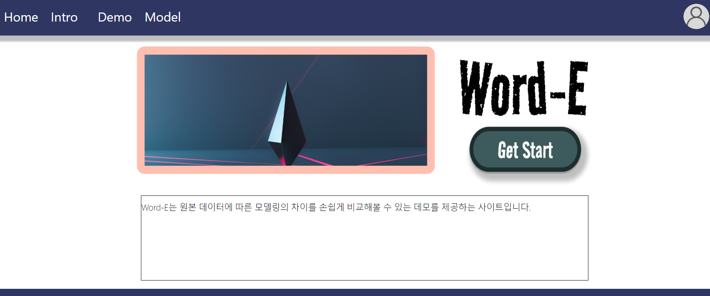

# WORD-E: 자연어 임베딩 모델 공유 / 데모 사이트

---



- `자연어 처리 모델 공유 및 데모 웹 서비스`로, 초등학생 중학생 고등학생을 포함한 해당 분야를 처음 접하는 학생들을 대상으로 합니다.
- 'Word-E'의 핵심 기능은 사용자가 서비스의 기능과 성능을 빠르게 테스트할 수 있는 데모 테스트입니다. 데모 테스트는 추가적인 코딩 없이 바로 웹 내에서 다른 사용자의 모델을 불러와 유사도 검사를 실행할 수 있습니다.
- 포스트, 모델 업로드 다운로드 기능을 제공하여 모델과 데이터를 다른 사용자와 공유할 수 있습니다.
- 모델은 법률, 영화, 댓글, 소설 등 다양한 데이터 셋으로 학습되어 있으며 `데이터 특성에 따른 유사도 결과 차이를 직관적으로 학습`할 수 있습니다.

## ✔️ 사이트 링크

---

<aside>
💡 **https://web-word-e-front-5llo2alhg6lxfy.sel4.cloudtype.app/main**

</aside>


`CLOUD TYPE` 으로 배포하였지만, 

메모리 용량 부족으로 서버 상에서 
`유사도 검사 시스템`과 
용량이 아주 작지 않은 이상, 
`파일 업로드, 다운로드 기능`은 

작동하지 않습니다.

**로컬에서는 문제 없이 작동합니다.** 

서버 메모리 증가하면 해결될 문제라 생각합니다.

## ✔️ 주요 기능

---

**단어 유사도 검사**

입력 단어와 모델 내 정의된 단어들의 유사도를 비교하여 가장 유사한 단어 30개를 출력합니다.


**문장 유사도 검사**

기준 문장과 입력된 모든 문장과의 유사도를 계산하여 출력합니다.


**글쓰기 / 글수정**

모델과 데이터를 포함한 글(포스트)을 작성하고 수정할 수 있습니다. 글이 많이 작성되어 모델이 많이 공유될 수록 사용자의 선택지는 넓어집니다. 글수정은 작성자만 가능합니다.


**IMPORT / EXPORT 기능**

사용자가 글(포스트)에 포함된 모델을 `IMPORT / EXPORT` 토글 버튼을 이용해 간편하게 데모 페이지의 `Select Model 항목`에 추가할 수 있습니다. 웹페이지의 사용감을 개선하는 효과가 있습니다.


**검색 기능**

글(포스트)들은 `[기사, 댓글, 정치]` 과 같은 태그 리스트와 함께 저장됩니다. 이 태그들을 기준으로 검색을 할 수 있습니다.


**파일 업로드 / 다운로드**

글(포스트)과 함께 모델과 데이터를 업로드하고 다운로드 할 수 있습니다. 쉬운 데모 환경 제공이라는 사이트의 목적에 맞게, 모델을 반드시 업로드 해야 글(포스트)을 저장할 수 있습니다. 하단에 다운로드(업로드)상황을 알 수 있는 `Progress Bar`가 구현되어 있습니다.


## ✔️ REQUIREMENT

---

**Front End**

```bash
npm install react axios
npm install react-router-dom react-modal react
```

**Back End**

```bash
pip install django djangorestframework
pip install django-cors-headers mysqlclient
pip install django-cors-headers
pip install djangorestframework-simplejwt
```

**Calculate Similarity**

```bash
pip install gensim
pip install konlpy
pip install numpy
```

## ✔️ 실행 방법

---

**React**

```bash
npm start
```

**Django**

```bash
python manage.py runserver
```

## ✔️ 사용 툴

---

- Front: `REACT`
- Back: `DJANGO REST FRAMEWORK`
- DB: `MY SQL`
- Deploy: `CLOUD TYPE`
- 일정관리: `NOTION`

<aside>
💡 [https://web-word-e-front-5llo2alhg6lxfy.sel4.cloudtype.app/main](https://www.notion.so/561866bfbb28409590d139bedb1ba44b)

</aside>

## ✔️ 마스코트

---


이미지 생성 AI (STABLE DIFFUSION)

## 😂 구현 X

---

**시간이 부족했습니다…**

- 글 삭제 기능
- 댓글 기능
- MONGO DB ⇒ MY SQL
